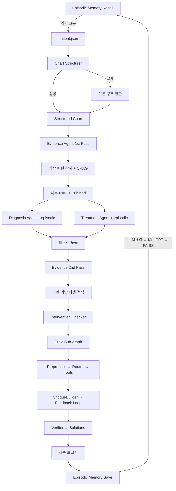

# CARE-CRITIC

**AI-Powered M&M Conference System with Episodic Memory**

의료 케이스 비판적 분석 시스템 - **Multi-Agent + RAG + Episodic Memory + Critic Sub-graph + OpenAI GPT-4o** 기반 자동화된 Morbidity & Mortality 검토

## 개요

CARE-CRITIC은 **실제 의료팀의 M&M(Morbidity and Mortality) 컨퍼런스**를 모델로 한 AI 시스템입니다. 

환자 데이터를 입력받아 **차트 구조화(IE) + 임상 패턴 감지 + 2-Pass CRAG(Corrective RAG) + Intervention Checker + Critic Sub-graph(Router→Tools→Feedback) + Episodic Memory(1+3)**를 통해, 마치 여러 명의 전문의가 모여 케이스를 리뷰하듯이 비판적 검토 포인트 및 해결책을 제시합니다.

> **"한 명의 의사가 아닌, 전체 의료팀이 함께 검토하는 AI"**
> **"과거 유사 케이스에서 학습하여 점점 나아지는 AI"**
> **OpenAI GPT-4o (안정적이고 빠른 추론 모델) 사용**

**핵심 특징:**
- **하이브리드 접근**: CDSS 체크리스트(알레르기/금기/패턴) + M&M 사후 학습 방식
- **에피소딕 메모리 (1+3 전략)**: 진단명 기반 사전 필터 + LLM 요약 임베딩으로 과거 경험 검색 → 모든 노드에 주입
- **Critic Sub-graph**: Preprocessing → LLM Router → Lens/Behavior 도구 실행 → CritiqueBuilder → Feedback 루프 → Verifier
- **임상 패턴 자동 감지**: VTE 고위험(수술력+흉통+저산소+DVT sign) 자동 인식 → PE 감별 유도
- **Chart Structurer**: 원문 → 구조화된 JSON (Vitals, 증상, 이미 시행된 치료 등)
- **스마트 검색 쿼리**: 진단 불명 + 임상 맥락 → "pulmonary embolism post-operative DVT Wells score CTPA"
- **Intervention Checker**: 이미 시행된 치료 감지 → "부재"류 허위 비판 차단
- **Evidence Quality 평가**: 무관한 문헌 검색 자동 감지 (예: Crohn/H.pylori) → "Evidence retrieval failure" 비판
- **Disposition 평가**: 고위험 상황에서 조기 퇴원 비판
- **견고한 에러 처리**: 
  - Fallback 제거 → 기본값 제공 (예: 기본 쿼리, 기본 구조)
  - 모든 LLM 호출에 timeout 설정 (30-60초)
  - 타입 안전성 보장 (리스트/딕셔너리 체크)
  - 명확한 에러 메시지 및 로깅
- **중앙화된 LLM 관리**: 
  - `src/agents/llm.py` 래퍼 + `src/llm/openai_chat.py` 저수준 API
  - 싱글톤 패턴으로 메모리 효율적
  - JSON 모드 및 timeout 설정 지원
- **2-Pass CRAG (Corrective RAG)**: 
  - **1차 검색**: 유사 케이스 + 일반 PubMed 검색 (진단/치료 분석 전)
  - **2차 검색**: 비판 내용 기반 타겟 검색 (진단/치료 분석 후)
  - 내부 유사도 >= 0.7 and >= 1개 → LLM 검증
  - LLM 검증 통과 → 내부 + 외부 모두 사용 (하이브리드)
  - LLM 검증 실패 or 내부 없음 → 외부(PubMed)만 사용
  - 비판에 맞는 정확한 근거 확보

## 프로젝트 배경: M&M 컨퍼런스 구조 모방

본 시스템은 **실제 의료팀의 M&M(Morbidity and Mortality) 컨퍼런스**를 모델로 설계되었습니다.

### M&M 컨퍼런스란?

의료 현장에서 환자의 예상치 못한 합병증, 사망, 치료 과정의 오류를 리뷰하여 **향후 유사 사례를 방지하고 환자 안전을 도모**하는 필수 품질 개선 회의입니다.

**핵심 원칙:**
- 🎯 **Blame-free culture**: 개인 책임보다 시스템 오류 찾기
- 📋 **Case-based learning**: 실제 케이스 기반 교육
- 🔍 **Root cause analysis**: 근본 원인 분석
- 📚 **Evidence-based review**: 최신 문헌 기반 평가
- ✅ **Action items**: 구체적 개선안 도출

### 실제 M&M 컨퍼런스 프로세스

```
1. [발표 전공의] 케이스 발표 (타임라인, 경과)
         ↓
2. [문헌 리뷰어] 최신 논문 리뷰 (표준 치료 비교)
         ↓
3. [진단 전문의] "왜 그때 그 진단을 했나?" (진단 적절성)
         ↓
4. [치료 전문의] "다른 조치는 없었나?" (치료 적절성)
         ↓
5. [간호사/약사] 현장 증언 (실제 시행된 조치)
         ↓
6. [부서장/좌장] 종합 평가 및 개선안 도출
         ↓
7. [후속 조치] "다음부터는 이렇게 하자" (가이드라인 변경)
```

### CARE-CRITIC = AI M&M 컨퍼런스

본 시스템은 이 프로세스를 **Multi-Agent 시스템으로 자동화**합니다.

| M&M 단계 | 시스템 컴포넌트 | 역할 |
|----------|----------------|------|
| **케이스 정리** | Chart Structurer | 발표 전공의처럼 차트를 구조화 |
| **문헌 리뷰** | Evidence Agent | 최신 가이드라인 자동 검색 |
| **진단 질의** | Diagnosis Agent | "감별진단은?" "Wells score는?" |
| **치료 질의** | Treatment Agent | "퇴원 결정은 적절했나?" "다른 치료는?" |
| **현장 증언** | Intervention Checker | "이미 시행된 치료" 확인 |
| **종합 평가** | Critic Sub-graph | Router → Tools → CritiqueBuilder → Feedback → Verifier |
| **경험 축적** | Episodic Memory (1+3) | 진단 필터 + LLM 요약 임베딩으로 교훈 축적 + 자동 회상 |

## 시스템 아키텍처

```
┌───────────────────────────────────────────────────────────────────────┐
│                     LangGraph Orchestrator (graph.py)                  │
│                       + Episodic Memory (1+3)                         │
├───────────────────────────────────────────────────────────────────────┤
│                                                                        │
│  [PRE] Episodic Memory Recall ─────────────────────────────────────── │
│     진단명 필터(1) + LLM 요약 임베딩 유사도(3) → 과거 교훈 주입       │
│                              ↓                                         │
│  [0] Chart Structurer ────────────────────────────────────────────── │
│     원문 → 구조화 JSON (Vitals, 증상, Red flags, 치료, 경과)          │
│                              ↓                                         │
│  [1] Evidence 1st Pass ──────────────────────────────────────────── │
│     임상 패턴 감지 → CRAG (내부 RAG + PubMed)                        │
│                              │                                         │
│               ┌──────────────┴──────────────┐                         │
│               ↓                              ↓                         │
│  [2] Diagnosis Agent              [3] Treatment Agent                  │
│     진단 적절성 + episodic        치료 적절성 + Disposition            │
│               │                              │                         │
│               └──────────────┬───────────────┘                         │
│                              ↓                                         │
│  [4] Evidence 2nd Pass ──────────────────────────────────────────── │
│     비판점 기반 PubMed 타겟 검색                                      │
│                              ↓                                         │
│  [5] Intervention Checker ───────────────────────────────────────── │
│     시행된 치료 확인 → 허위 비판 차단                                  │
│                              ↓                                         │
│  ┌─────────────────────────────────────────────────────────────────┐  │
│  │  [6] Critic Sub-graph (critic_graph.py)                         │  │
│  │  ┌───────────────────────────────────────────────────────────┐  │  │
│  │  │ Preprocessing (timeline, evidence, record_gaps)           │  │  │
│  │  │        ↓                                                   │  │  │
│  │  │ Router (LLM) → Lens/Behavior 도구 선택                   │  │  │
│  │  │        ↓                                                   │  │  │
│  │  │ Tool 실행 (예산 내)                                       │  │  │
│  │  │        ↓                                                   │  │  │
│  │  │ CritiqueBuilder (LLM) → critique_points                  │  │  │
│  │  │        ↓                                                   │  │  │
│  │  │ Feedback (품질 판단)                                      │  │  │
│  │  │    ├─ OK → 종료                                           │  │  │
│  │  │    └─ 불충분 → 추가 도구 실행 → 재빌드 (feedback loop)   │  │  │
│  │  │        ↓                                                   │  │  │
│  │  │ (선택) Verifier → solutions (유사 케이스 근거)            │  │  │
│  │  └───────────────────────────────────────────────────────────┘  │  │
│  └─────────────────────────────────────────────────────────────────┘  │
│                              ↓                                         │
│                           [END]                                        │
│                              ↓                                         │
│  [POST] Episodic Memory Save ─────────────────────────────────────── │
│     이번 분석 경험 저장: clinical_text → LLM 요약 → MedCPT → FAISS    │
│     메타데이터: 진단, critique, 교훈, solutions → JSON                 │
│                                                                        │
└───────────────────────────────────────────────────────────────────────┘
```

### 2-Pass CRAG 흐름도

```
┌─────────────────────────────────────────────────────────────────┐
│                       2-Pass CRAG Strategy                       │
├─────────────────────────────────────────────────────────────────┤
│                                                                  │
│  [1차 검색: 분석 전]                                            │
│  ┌─────────────────────────────────────────────────────────┐    │
│  │ 환자 데이터 → 임상 패턴 감지 → 일반 쿼리 생성           │    │
│  │      ↓                                                   │    │
│  │ 내부 RAG (유사 케이스) + PubMed (일반 가이드라인)        │    │
│  │      ↓                                                   │    │
│  │ Diagnosis/Treatment Agent가 근거로 활용                  │    │
│  └─────────────────────────────────────────────────────────┘    │
│                              ↓                                   │
│  [분석 단계]                                                    │
│  ┌─────────────────────────────────────────────────────────┐    │
│  │ Diagnosis Agent: "PE 진단 지연 가능성"                   │    │
│  │ Treatment Agent: "항응고제 누락"                         │    │
│  │      ↓                                                   │    │
│  │ 비판점(issues) 도출                                      │    │
│  └─────────────────────────────────────────────────────────┘    │
│                              ↓                                   │
│  [2차 검색: 분석 후] 🆕                                         │
│  ┌─────────────────────────────────────────────────────────┐    │
│  │ 비판점 수집 → 타겟 쿼리 생성                            │    │
│  │ 예: "pulmonary embolism missed diagnosis pneumonia       │    │
│  │      D-dimer diagnostic delay"                           │    │
│  │      ↓                                                   │    │
│  │ PubMed 검색 (비판 내용에 맞는 문헌)                      │    │
│  │      ↓                                                   │    │
│  │ 기존 evidence에 병합 (중복 PMID 제거)                    │    │
│  └─────────────────────────────────────────────────────────┘    │
│                              ↓                                   │
│  [Critic Agent]                                                  │
│  ┌─────────────────────────────────────────────────────────┐    │
│  │ 1차 검색: 유사 케이스 + 일반 가이드라인                  │    │
│  │ 2차 검색: 비판 내용에 맞는 타겟 문헌                     │    │
│  │      ↓                                                   │    │
│  │ 근거 있는 비판 + 정확한 해결책 생성                      │    │
│  └─────────────────────────────────────────────────────────┘    │
│                                                                  │
└─────────────────────────────────────────────────────────────────┘
```

## 핵심 특징

### 1. Multi-Agent 협력 구조 (2-Pass CRAG + Critic Sub-graph)
| Agent | 위치 | 역할 | 모델 |
|-------|------|------|------|
| **Chart Structurer** | `nodes/chart_structurer.py` | 차트 정보 구조화 (IE) | **GPT-4o** |
| **Evidence 1st Pass** | `nodes/evidence_agent.py` | 유사 케이스 + 일반 PubMed 검색 | **GPT-4o** + RAG + PubMed |
| **Diagnosis** | `nodes/diagnosis_agent.py` | 진단 적절성 분석 + episodic | **GPT-4o** |
| **Treatment** | `nodes/treatment_agent.py` | 치료 적절성 + Disposition + episodic | **GPT-4o** |
| **Evidence 2nd Pass** | `nodes/evidence_agent.py` | 비판 기반 타겟 PubMed 검색 | **GPT-4o-mini** + PubMed |
| **Intervention Checker** | `nodes/intervention_checker.py` | 이미 시행된 치료 확인 | Rule-based |
| **Critic Sub-graph** | `src/critic_agent/` | Preprocessing → Router → Tools → CritiqueBuilder → Feedback → Verifier | **GPT-4o** |
| **Episodic Memory** | `src/memory/episodic_store.py` | 과거 경험 저장/검색 (1+3 전략) | MedCPT + GPT-4o-mini |

### 2. 에피소딕 메모리 시스템 (Episodic Memory) — 1+3 전략

> **"과거 경험에서 학습하여, 유사 케이스를 만날 때마다 더 나은 분석을 수행"**

케이스 간 학습을 위한 크로스런 에피소딕 메모리:

```
[저장] 환자 A (CHF + 간경변) 분석 완료
     ↓
  clinical_text → GPT-4o-mini 요약 (150-200 words) → MedCPT 임베딩 → FAISS
  메타데이터 (진단명, critique, 교훈, solutions) → JSON

[검색] 3일 후, 환자 B (CHF + 간경변) 입력
     ↓
  1단계: 진단명 필터 (CHF, 간경변 매칭) → 후보 에피소드 선별
  2단계: FAISS 임베딩 유사도로 후보 내 순위
     ↓
  "과거 유사 케이스에서 벤조디아제핀 관련 critical 이슈 있었음"
     ↓
  모든 노드(Diagnosis, Treatment)가 이 교훈을 참조하여 분석
```

**1+3 검색 전략:**
| 단계 | 방법 | 역할 |
|------|------|------|
| **1 (필터)** | 진단명 기반 사전 필터 | 같은 진단의 에피소드를 확실히 포착 |
| **3 (순위)** | LLM 요약 임베딩 유사도 | 같은 진단 내에서 가장 유사한 경험 순위 |
| **Fallback** | 진단 매칭 없으면 전체 FAISS 검색 | 유사 임상 패턴 탐색 |

**저장 흐름:**
- `clinical_text` → GPT-4o-mini 요약 (150-200 words) → MedCPT 임베딩 → FAISS
- 요약문은 512 토큰 이내에 충분히 들어가므로 **청킹 불필요**

**저장 구조 (에피소드 1건):**
```json
{
  "episode_id": "EP-20260212_191219",
  "diagnosis": "CHF with hepatic encephalopathy",
  "secondary_diagnoses": ["Cirrhosis", "Hypertension"],
  "outcome": "expired",
  "confidence": 0.85,
  "clinical_summary": "68yo M with CHF and cirrhosis presenting with AMS...",
  "critique_summary": [
    {"issue": "간경변 환자에 Lorazepam 투여", "severity": "critical", "category": "medication"}
  ],
  "lessons_learned": [
    "[Critical] 간경변 + AMS 환자에서 벤조 HE 악화 위험",
    "[Solution] HE 유발요인 체크리스트 -> 감염/GI출혈/전해질/변비/약물"
  ],
  "key_solutions": [
    {"target_issue": "벤조 투여 위험", "action": "Lactulose/Rifaximin 우선", "priority": "immediate"}
  ]
}
```

**기술 스택:**
- 저장 임베딩: GPT-4o-mini 요약 → MedCPT Query Encoder (RAG와 모델 공유 → 중복 로딩 없음)
- 인덱스: FAISS IndexFlatIP (cosine similarity)
- 검색: 진단명 필터 → FAISS 유사도 순위
- 저장소: `data/episodic_db/` (episodic_faiss.idx + episodic_meta.json)

### 3. 임상 패턴 자동 감지 (Evidence Agent) 🎯

> **CDSS 로직 차용**: 실시간 경고 대신 사후 검토 시 고위험 패턴 자동 인식

```
임상 텍스트 입력 → CDSS 패턴 매칭 → 맞춤형 검색 쿼리 생성
```

**감지 패턴 (CDSS 체크리스트):**

**1️⃣ VTE 고위험 (가장 치명적)**
- **트리거**: 수술력 + 흉통 + 저산소 + DVT sign
- **검색 쿼리**: `"pulmonary embolism post-operative DVT Wells score CTPA d-dimer guideline emergency diagnosis"`
- **예시 케이스**: 무릎 수술 3주 후 + 갑작스러운 흉막성 흉통 + SpO2 90% + 우측 종아리 압통
- **결과**: PE 감별진단 유도, CTPA/D-dimer 검사 권고

**2️⃣ ACS 패턴**
- **트리거**: troponin 언급 + 흉통
- **검색 쿼리**: `"acute coronary syndrome chest pain troponin guideline"`

**3️⃣ 진단 불명 + 호흡곤란**
- **트리거**: 진단 "Unknown" or "Musculoskeletal" + 저산소 + 호흡곤란
- **검색 쿼리**: `"acute dyspnea hypoxemia differential diagnosis pulmonary embolism pneumonia heart failure"`

### 3. Evidence Quality 자동 평가 (Critic Agent) 🔍

**문제 감지:**
```python
# Critic이 자동으로 검색된 문헌의 관련성 체크
irrelevant_keywords = ["crohn", "h. pylori", "helicobacter", "cat", "feline"]
if any(keyword in title.lower() for title in pubmed_titles):
    → "Evidence retrieval failure" 비판 생성
```

**비판 예시:**
```json
{
  "issue": "Evidence retrieval failure - 임상 시나리오와 무관한 문헌 검색",
  "severity": "critical",
  "category": "evidence_quality",
  "evidence_support": "검색된 문헌이 Crohn disease, H. pylori에 관한 것으로 PE 의심 케이스와 무관. 잘못된 근거 사용 위험."
}
```

### 4. Disposition 평가 (Treatment Agent) 🏥

> **데이터 소스:** Chart Structurer가 텍스트 분석으로 생성한 `outcome.disposition` 사용 (CSV 칼럼 아님)

**고위험 상황에서 조기 퇴원 비판:**
- 진단 불명확 (Unknown)
- 치명적 감별진단 (PE, ACS) 배제 안됨
- 저산소증 (SpO2 < 94%) 지속
- VTE 고위험 + 감별진단 미완료

**비판 예시:**
```json
{
  "issue": "환자의 SpO2가 90%로 저산소증이며, 진단이 불명확한 상황에서 같은 날 퇴원은 부적절함",
  "severity": "critical",
  "category": "disposition",
  "evidence_support": "폐색전증 감별이 완료되지 않은 상태에서의 퇴원은 잠재적 급사 위험"
}
```

### 5. 견고한 에러 처리 ⚡

**개선된 에러 처리 전략:**

1. **Fallback 제거 → 기본값 제공**
   ```python
   # ❌ 기존: None 반환
   if llm_failed:
       return None  # 다음 단계에서 에러 발생
   
   # ✅ 개선: 기본값 제공
   if llm_failed:
       return default_query  # "{diagnosis} complications diagnostic error"
   ```

2. **타입 안전성 보장**
   ```python
   # 모든 리스트/딕셔너리 접근 전 타입 체크
   medications = interventions.get("medications", [])
   if isinstance(medications, list):
       for m in medications:
           if isinstance(m, dict) and "name" in m:
               process(m["name"])
   ```

3. **Timeout 설정**
   ```python
   # 모든 LLM 호출에 timeout 추가 (30-60초)
   response = client.chat.completions.create(
       model="gpt-4o",
       messages=[...],
       timeout=60
   )
   ```

4. **명확한 에러 메시지**
   ```python
   # 로그에 실패 이유 명시
   print(f"  [ERROR] LLM query generation failed: {e}")
   print(f"  [Strategy] Using default query: {default_query}")
   ```

5. **보수적 접근 (Evidence Agent)**
   - LLM 검증 실패 → 외부(PubMed)만 사용
   - 내부 근거 품질 불충분 → 외부만 사용
   - 안전하고 신뢰할 수 있는 결과 보장

## 데이터 플로우



## 실행 예시

### 콘솔 출력
```bash
$ python scripts/run_agent_critique.py

============================================================
Multi-Agent Medical Critique System (LLM-Enhanced)
============================================================

[1/5] Loading RAG retriever + Episodic Memory...
  [EpisodicMemory] FAISS 인덱스 로드: 3건
  [EpisodicMemory] 메타데이터 로드: 3건
  [EpisodicMemory] 3건의 과거 경험 로드됨

[2/5] Loading patient case...
  Clinical text length: 2894 chars
  Extracting diagnosis with LLM...
  Patient ID: 22222222
  Primary Diagnosis: Pulmonary embolism rule-out
  Secondary Diagnoses: ['Hypertension', 'Recent knee surgery']
  Key Conditions: ['DVT history']
  Confidence: high
  Outcome: alive

[3/5] Retrieving similar cases (top_k=3)...
  ✗ Case 11111: similarity=0.654 [REJECTED - below 0.7]
  ⚠ No valid similar cases (all below 0.7 threshold)
  → CRAG will use external PubMed only

[Episodic Memory] 과거 유사 경험 발견 → 각 노드 프롬프트에 주입

[4/5] Running agent graph...

[Chart Structurer] Running...
  [OK] Structured successfully

[Evidence Agent] Running...
  [ALERT] PE high-risk pattern detected!

[Diagnosis Agent] Running... (+ episodic lessons)
[Treatment Agent] Running... (+ episodic lessons)

[Evidence 2nd Pass] Starting critique-based search...
  [2nd Pass] Found 3 preliminary issues

[Intervention Checker] Running...

[Critic Sub-graph] Running...
  Preprocessing → Router → Tools → CritiqueBuilder → Feedback

[5/5] Results:
============================================================

[DIAGNOSIS EXTRACTION]:
  Primary Diagnosis: Pulmonary embolism rule-out
  Secondary Diagnoses: Hypertension, Recent knee surgery
  Confidence: high
  Method: GPT-4o extraction

[EVIDENCE QUALITY]:
  Mode: external_only
  Internal cases: 0
  Reason: 유사 케이스 없음 (모두 유사도 < 0.7)

[CRITIQUE POINTS - BY SEVERITY]:

  [CRITICAL]:
    1. [DIAGNOSIS] PE 감별진단 누락 - Wells score 미계산
    2. [DISPOSITION] SpO2 90% + 진단 불명확 → 조기 퇴원 부적절

  [MEDIUM]:
    1. [TREATMENT] D-dimer 미시행

[SOLUTIONS]:
  1. [immediate] CT Pulmonary Angiography (CTPA) 시행
     Citation: ACCP Guidelines on Pulmonary Embolism
  2. [immediate] 입원 전환 및 감시 모니터링
     Citation: American Thoracic Society Guidelines

[EPISODIC MEMORY]: 과거 유사 경험 참조됨 ✓
[OK] Report saved: outputs/reports/AGENT-CRITIQUE-20260212_143052.json

Done!
```

## 디렉토리 구조

```
LGBM/
├── src/
│   ├── agents/                          # Multi-Agent 오케스트레이터
│   │   ├── __init__.py
│   │   ├── graph.py                     # LangGraph Orchestrator (메인 그래프)
│   │   ├── state.py                     # AgentState (TypedDict)
│   │   ├── llm.py                       # LLM 래퍼 (싱글톤, get_llm())
│   │   ├── critic_adapter.py            # Critic Sub-graph ↔ 메인 그래프 어댑터
│   │   └── nodes/                       # 개별 에이전트 노드
│   │       ├── __init__.py
│   │       ├── chart_structurer.py      # Chart → JSON 구조화 (IE)
│   │       ├── evidence_agent.py        # 2-Pass CRAG + 임상 패턴 감지
│   │       ├── diagnosis_agent.py       # 진단 적절성 분석 + episodic
│   │       ├── treatment_agent.py       # 치료 적절성 + Disposition + episodic
│   │       └── intervention_checker.py  # 시행된 치료 확인 (Rule-based)
│   │
│   ├── critic_agent/                    # Critic Sub-graph (LangGraph 서브그래프)
│   │   ├── critic_graph.py              # 서브그래프 정의 (preprocess→router→tools→feedback)
│   │   ├── critique_builder.py          # LLM 기반 비판점 생성
│   │   ├── feedback.py                  # 비판 품질 피드백 + 반복 제어
│   │   ├── router.py                    # LLM Router (도구 선택)
│   │   ├── registry.py                  # 도구 레지스트리
│   │   ├── runner.py                    # AgentConfig, ToolRegistry
│   │   ├── tool_base.py                 # 도구 베이스 클래스
│   │   ├── toolrag.py                   # ToolRAG 인덱스
│   │   ├── types.py                     # AgentState (Critic 전용)
│   │   ├── verifier.py                  # Verifier (유사 케이스 기반 solutions)
│   │   └── tools/                       # Critic 분석 도구
│   │       ├── __init__.py
│   │       ├── preprocess_timeline.py   # 타임라인 전처리
│   │       ├── preprocess_evidence.py   # 근거 전처리
│   │       ├── preprocess_gaps.py       # 기록 갭 분석
│   │       ├── lens_diagnostic_consistency.py   # 진단 일관성 렌즈
│   │       ├── lens_monitoring_response.py      # 모니터링 응답 렌즈
│   │       ├── lens_severity_risk.py            # 중증도/위험 렌즈
│   │       └── behavior_topk_direct_compare.py  # Top-K 직접 비교
│   │
│   ├── llm/                             # 저수준 LLM API
│   │   ├── __init__.py
│   │   └── openai_chat.py               # OpenAI Chat Completions 래퍼
│   │
│   ├── memory/                          # 에피소딕 메모리 시스템
│   │   ├── __init__.py
│   │   └── episodic_store.py            # 1+3: 진단 필터 + LLM 요약 임베딩
│   │
│   └── retrieval/                       # RAG 시스템
│       ├── __init__.py
│       └── rag_retriever.py             # 3-Stage RAG (MedCPT + FAISS + BGE)
│
├── scripts/
│   ├── run_agent_critique.py            # 메인 실행 스크립트 (LLM 진단 추출 포함)
│   └── build_vector_db.py              # Vector DB 구축
│
├── docs/                                # 프로젝트 문서
│   ├── CODE_ANALYSIS_CRITIC.md          # Critic 서브그래프 코드 분석
│   ├── MERGE_PLAN_LGBM_CRITIC.md       # 병합 계획
│   └── MERGE_SUMMARY_CRITIC.md         # 병합 요약
│
├── data/                                # 데이터 (gitignored)
│   ├── patient.json                     # 입력 환자 데이터
│   ├── vector_db/                       # RAG FAISS 인덱스
│   │   ├── faiss_index.idx
│   │   └── metadata.pkl
│   └── episodic_db/                     # 에피소딕 메모리 DB (자동 생성)
│       ├── episodic_faiss.idx
│       └── episodic_meta.json
│
├── outputs/
│   └── reports/                         # 생성된 보고서 (JSON)
│
├── requirements.txt
└── README.md
```

### 주요 컴포넌트 설명

#### `src/agents/graph.py` - LangGraph Orchestrator

메인 그래프: 에피소딕 메모리 검색 → 6개 노드 → Critic Sub-graph → 에피소딕 메모리 저장

```python
from src.agents import MedicalCritiqueGraph
from src.memory import EpisodicMemoryStore

# 에피소딕 메모리 (RAG 임베딩 모델 공유)
episodic = EpisodicMemoryStore(shared_embedder=rag.vector_db)
episodic.load()

# 그래프 생성
graph = MedicalCritiqueGraph(rag_retriever=rag, episodic_store=episodic)

# 실행
result = graph.run(
    patient_case=patient_case,
    similar_cases=similar_cases,
)
# result: { critique, solutions, episodic_lessons_used, confidence, ... }
```

**실행 순서:**
```
[PRE] Episodic Memory Recall (진단 필터 + 임베딩 유사도)
    → chart_structurer
    → evidence_1st (CRAG: 내부 RAG + PubMed)
    → (diagnosis_agent || treatment_agent)  # 병렬 + episodic_lessons
    → evidence_2nd (비판 기반 타겟 PubMed)
    → intervention_checker
    → critic sub-graph (preprocess → router → tools → critique → feedback → verifier)
    → END
[POST] Episodic Memory Save (LLM 요약 → MedCPT → FAISS)
```

#### `src/critic_agent/` - Critic Sub-graph

독립적인 LangGraph 서브그래프로 구현된 비판 파이프라인:

```
Preprocessing (timeline, evidence, record_gaps)
      ↓
Router (LLM) → 분석 도구 선택 (예산 내)
      ↓
Tool 실행:
  - lens_diagnostic_consistency   # 진단 일관성
  - lens_monitoring_response      # 모니터링 응답
  - lens_severity_risk            # 중증도/위험
  - behavior_topk_direct_compare  # 유사 케이스 직접 비교
      ↓
CritiqueBuilder (LLM) → critique_points (span_id, severity, cohort_comparison)
      ↓
Feedback (품질 판단)
  ├─ OK → 종료
  └─ 불충분 → 추가 도구 실행 → CritiqueBuilder 재호출 (feedback_rounds)
      ↓
Verifier → solutions (유사 케이스 근거)
```

**주요 모듈:**
| 모듈 | 역할 |
|------|------|
| `critic_graph.py` | 서브그래프 정의 및 상태 관리 |
| `critique_builder.py` | LLM으로 비판점 생성 |
| `feedback.py` | 비판 품질 평가 + 반복 제어 |
| `router.py` | LLM으로 분석 도구 선택 |
| `verifier.py` | 유사 케이스 기반 솔루션 검증 |
| `tools/` | Lens(분석 관점) + Behavior(비교 행동) 도구 |

#### `src/agents/llm.py` - LLM 래퍼

```python
from src.agents.llm import get_llm

llm = get_llm()  # 싱글톤
response = llm.gpt4o(
    prompt="진단을 분석하세요",
    system="당신은 의료 전문가입니다",
    temperature=0.0,
    json_mode=True,
    timeout=60
)
```

#### `src/memory/episodic_store.py` - 에피소딕 메모리

1+3 전략 구현:

```python
store = EpisodicMemoryStore(shared_embedder=rag.vector_db)
store.load()

# 저장: clinical_text → LLM 요약 → MedCPT → FAISS
store.add_episode(patient_case, critique_points, solutions, confidence)

# 검색: 진단명 필터 → FAISS 유사도 순위
episodes = store.search_similar_episodes(
    clinical_text="...",
    diagnosis="CHF",
    secondary_diagnoses=["Cirrhosis"],
    top_k=2,
    min_similarity=0.3,
)

# 프롬프트 주입용 문자열
prompt_text = store.format_for_prompt(episodes, max_episodes=2)
```

## 설치 및 실행

### 1. 환경 설정
```bash
# 1. 저장소 클론
git clone https://github.com/yourusername/LGBM.git
cd LGBM

# 2. 가상환경 생성 및 활성화 (선택)
python -m venv venv
source venv/bin/activate  # Windows: venv\Scripts\activate

# 3. 패키지 설치
pip install -r requirements.txt
```

### 2. API 키 설정
`.env` 파일 생성:
```env
OPENAI_API_KEY=your-openai-api-key-here
LLM_MODEL=gpt-4o
PUBMED_EMAIL=your-email@example.com
```

**환경변수 설명:**
- `OPENAI_API_KEY`: OpenAI API 키 (필수)
- `LLM_MODEL`: 사용할 LLM 모델명 (기본: `gpt-4o`, 다른 모델로 변경 가능)
- `PUBMED_EMAIL`: PubMed API 사용을 위한 이메일 (필수)

### 3. 데이터 준비

#### 3.1 벡터 DB 빌드 (최초 1회)
```bash
# df_flag0_final_processed.csv + df_flag1_final_processed.csv 사용
python scripts/build_vector_db.py
```

**입력 파일:**
- `data/df_flag0_final_processed.csv` (hospital_expire_flag = 0)
- `data/df_flag1_final_processed.csv` (hospital_expire_flag = 1)

**출력 파일:**
- `data/processed_data.json` (전처리된 데이터)
- `data/vector_db/` (FAISS 벡터 DB)

#### 3.2 환자 케이스 준비
`data/patient.json` 형식:
```json
{
  "id": "22222222",
  "status": "alive",
  "sex": "F",
  "age": 68,
  "admission_type": "EMERGENCY",
  "discharge_location": "HOME",
  "text": "Name: Jane Doe ... [전체 차트 텍스트]"
}
```

### 4. 실행
```bash
# 메인 실행 (LLM 진단 추출 + Multi-Agent + Episodic Memory)
python scripts/run_agent_critique.py
```

**실행 시 자동 수행:**
1. RAG Retriever + Episodic Memory 로드 (MedCPT 모델 공유)
2. `data/patient.json` 로드 + GPT-4o로 진단 추출 (Primary + Secondary)
3. 유사 케이스 검색 (similarity >= 0.7 필터)
4. 에피소딕 메모리 검색 (진단 필터 + 임베딩 유사도)
5. LangGraph 그래프 실행 (6개 노드 + Critic Sub-graph)
6. 에피소딕 메모리에 이번 경험 저장 (LLM 요약 → MedCPT → FAISS)
7. 결과 JSON 저장 (`outputs/reports/`)

## 주요 컴포넌트

### Episodic Memory Store (1+3 전략)
- **경로**: `src/memory/episodic_store.py`
- **저장소**: `data/episodic_db/` (최초 실행 시 자동 생성)
- **검색 전략**: 진단명 필터(1) → FAISS 임베딩 유사도 순위(3)
- **저장 흐름**: `clinical_text` → GPT-4o-mini 요약 → MedCPT 임베딩 → FAISS (청킹 불필요)
- **API**:
  - `add_episode()`: 분석 완료 후 경험 저장 (LLM 요약 → 임베딩 + 메타데이터)
  - `search_similar_episodes(clinical_text, diagnosis, secondary_diagnoses)`: 진단 필터 + 유사도 검색
  - `format_for_prompt()`: 검색 결과를 프롬프트 주입용 문자열로 변환
- **임베딩 모델 공유**: RAGRetriever의 MedCPT 모델을 `shared_embedder`로 전달 → 중복 로딩 방지

### Chart Structurer
- **입력**: 원문 텍스트 (patient.json의 `text` 필드)
- **출력**: 구조화된 JSON (vitals, symptoms, red_flags, interventions_given, clinical_course, outcome)

### Evidence Agent (2-Pass CRAG)
- **1차**: 임상 패턴 감지 (VTE, ACS 등) → CRAG (내부 RAG + PubMed)
- **2차**: 비판점 기반 타겟 PubMed 검색

### Diagnosis Agent
- 구조화 데이터 기반 진단 적절성 분석
- `episodic_lessons` 참조 (과거 유사 케이스 교훈)

### Treatment Agent
- Disposition 평가 + 치료 적절성 + `episodic_lessons` 참조

### Intervention Checker
- 시행된 치료 확인 (Rule-based) → 허위 비판 차단

### Critic Sub-graph (`src/critic_agent/`)
- LangGraph 서브그래프로 독립 실행
- Preprocessing → LLM Router → Lens/Behavior 도구 → CritiqueBuilder → Feedback 루프
- Verifier: 유사 케이스 기반 솔루션 검증
- `critic_adapter.py`를 통해 메인 그래프와 상태 변환

## 테스트 케이스

### PE 고위험 케이스
**입력:**
- 68세 여성, 무릎 수술 3주 전
- 갑작스러운 흉막성 흉통
- SpO2 90%, HR 112, RR 24
- 우측 종아리 비대 + 압통
- 진단: Unknown / Musculoskeletal + Panic Attack
- Disposition: Same-Day Discharge

**기대 결과:**
- ✅ PE 고위험 패턴 감지
- ✅ 쿼리: "pulmonary embolism post-operative DVT Wells score CTPA"
- ✅ 비판: 치명적 진단 실패 (PE 배제 안됨)
- ✅ 비판: 부적절한 조기 퇴원
- ✅ 해결책: CTPA 시행, 입원 전환

**실제 결과:** ✅ 모두 달성

## 학술적 근거 및 의료 현장 연결

### 1. 영감을 받은 학술 논문

#### 📚 CRAG (Corrective RAG)
**논문:** Shi, W., et al. (2024). "Corrective Retrieval Augmented Generation"  
**적용:** Evidence Agent의 동적 검색 전략

```python
# 의료 현장 유사 상황: 문헌 리뷰 중 추가 검색
교수: "이 논문만으로는 부족한데, PubMed에서 최신 가이드라인도 찾아봐"

# CARE-CRITIC 구현:
if internal_similarity < 0.7:  # 내부 케이스 품질 낮음
    use_pubmed_only()  # 외부 문헌만 사용
else:
    use_both()  # 내부 + 외부 통합
```

**핵심 아이디어:**  
"검색 결과의 품질을 평가하고, 부족하면 외부 소스로 보강"

---

#### Episodic Memory (1+3 전략)
**논문:** Park, J.S., et al. (2023). "Generative Agents: Interactive Simulacra of Human Behavior"  
**적용:** 크로스런 학습 메모리 시스템 — Reflexion 반복 루프 대신 과거 경험 축적으로 학습

```python
# 의료 현장 유사 상황: 경험 많은 의사의 패턴 인식
교수: "이 케이스, 3개월 전 CHF+간경변 환자랑 비슷하네. 그때 벤조 문제 있었잖아"

# CARE-CRITIC 구현 (1+3 전략):
# 1. 저장: clinical_text → GPT-4o-mini 요약 → MedCPT 임베딩 → FAISS
store.add_episode(patient_case, critiques, solutions, confidence)

# 2. 검색: 진단명 필터(1) + LLM 요약 임베딩 유사도(3)
episodes = store.search_similar_episodes(
    clinical_text, diagnosis="CHF", secondary_diagnoses=["Cirrhosis"]
)
# → 같은 진단의 과거 경험 우선 → 모든 노드가 교훈 참조
```

**핵심 아이디어:**  
"진단명으로 관련 경험을 빠르게 필터하고, 임베딩 유사도로 정밀 순위 매겨 활용"

---

#### 👥 Multi-Agent Collaboration
**논문:** Wu, Q., et al. (2023). "AutoGen: Enabling Next-Gen LLM Applications via Multi-Agent Conversation"  
**적용:** 전체 시스템 아키텍처

```python
# 의료 현장 유사 상황: M&M 컨퍼런스 전문가 토론
진단 전문의: "이건 PE 가능성이 높아"
치료 전문의: "그럼 항응고제는?"
간호사: "실제로는 산소만 투여했습니다"
부서장: "종합하면..."

# CARE-CRITIC 구현:
Chart Structurer → Evidence Agent → Diagnosis Agent
                                  ↓
                              Treatment Agent
                                  ↓
                  ← Intervention Checker
                                  ↓
                              Critic Agent
```

**핵심 아이디어:**  
"여러 전문가가 각자의 역할을 수행하며 협력"

---

#### 🏥 MedCPT
**논문:** Jin, Q., et al. (2023). "MedCPT: Contrastive Pre-trained Transformers with Large-scale PubMed Search Logs"  
**적용:** 3-Stage RAG Retriever

```python
# 의료 현장 유사 상황: 효율적인 문헌 검색
전공의: "PE 관련 논문 3만 개... 어떻게 찾지?"
교수: "일단 MeSH term으로 필터링하고, 관련도 높은 것만 봐"

# CARE-CRITIC 구현:
1. MedCPT retrieval (의료 특화 벡터 검색)
2. FAISS indexing (빠른 유사도 탐색)
3. BGE-reranker (최종 정렬)
```

**핵심 아이디어:**  
"의료 특화 사전학습 모델로 정확한 문헌 검색"

---

### 2. 의료 업계 관행과의 연결

본 시스템은 **실제 병원의 품질 관리 프로세스**를 AI로 자동화합니다.

#### 🏥 M&M Conference (Morbidity and Mortality Conference)

**기원 및 역사:**
- 1894년 Johns Hopkins Hospital에서 시작
- William Osler가 "학습과 개선을 위한 비판적 검토" 철학 제시
- 현재 전 세계 병원에서 필수 품질 관리 활동

**목적:**
1. **환자 안전 개선** - 유사 사고 재발 방지
2. **교육** - 실제 케이스 기반 학습
3. **시스템 개선** - 프로토콜 및 가이드라인 업데이트
4. **Blame-free culture** - 개인 비난이 아닌 시스템 문제 찾기

**CARE-CRITIC = 자동화된 M&M Conference**

| 의료 현장 프로세스 | CARE-CRITIC 구현 |
|------------------|-----------------|
| **매주 1회 회의** | **실시간 자동 분석** |
| 수동 케이스 선정 | 모든 케이스 분석 가능 |
| 2-3시간 소요 | 2-3분 완료 |
| 5-10명 전문가 필요 | AI Multi-Agent |
| 주관적 판단 혼재 | 일관된 기준 적용 |
| 문서화 부담 | 자동 보고서 생성 |

---

#### 🔬 Clinical Decision Support Systems (CDSS)

**의료 현장의 CDSS 역할:**
```
입력: 환자 데이터
 ↓
알고리즘: 가이드라인 체크
 ↓
출력: 알림 (예: "CKD 환자에 NSAID 처방 주의")
```

**CARE-CRITIC의 방식:**
```
입력: 완료된 케이스
 ↓
CDSS 로직 적용: 알레르기/금기/임상 패턴 체크
 ↓
Multi-Agent 분석: 비판적 검토
 ↓
출력: "왜 그 결정이 문제였는지" + "어떻게 개선할지"
```

→ **CDSS의 체크리스트 + M&M의 사후 학습 방식 = 하이브리드**
- ✅ **CDSS 로직 차용**: 알레르기 충돌, 금기사항, VTE/ACS 패턴 인식
- ✅ **M&M 시점 적용**: 완료된 케이스 분석 (실시간 예방 아님)
- ✅ **목적**: 시스템 개선 및 의료진 교육

---

#### 📋 Root Cause Analysis (RCA)

**의료 사고 분석 5-Why 기법:**
```
환자 사망
→ Why? PE로 인한 급사
→ Why? PE를 진단하지 못함
→ Why? CTPA를 시행하지 않음
→ Why? 고위험 환자로 인식하지 못함
→ Why? 수술 후 환자 체크리스트 부재

→ 해결책: 수술 후 VTE 체크리스트 도입
```

**CARE-CRITIC 구현:**
```python
# Evidence Agent: 패턴 감지
detect_pattern("recent surgery + chest pain + hypoxia")
→ "VTE high-risk"

# Diagnosis Agent: 진단 실패 분석
"PE 감별진단 누락, Wells score 미계산"

# Critic Agent: Root cause
"고위험 패턴 인식 실패 → 프로토콜 강화 필요"
```

---

#### 🎓 Grand Rounds

**정의:** 주요 케이스에 대한 교육 세션 (전문의 발표 + 토론)

**차이점:**
| Grand Rounds | M&M | CARE-CRITIC |
|--------------|-----|-------------|
| **목적: 교육** | **목적: 품질 개선** | **목적: 자동 검토** |
| 흥미로운 케이스 | 문제있는 케이스 | 모든 케이스 |
| 칭찬 + 학습 | 비판 + 개선 | 비판 + 해결책 |
| 월 1회 | 주 1회 | 실시간 |

→ **CARE-CRITIC은 M&M에 가까움**

---

### 3. 핵심 설계 철학의 출처

#### 🚫 Blame-free Culture
**출처:** James Reason의 "Human Error" (1990)  
**의료 적용:** Swiss Cheese Model (다층 방어 실패)

```python
# ❌ 잘못된 비판
"담당의가 PE를 놓쳤다"

# ✅ 시스템 비판 (CARE-CRITIC)
"수술 후 환자에 대한 VTE 체크리스트 부재"
"고위험 환자 식별 프로토콜 필요"
```

---

#### 📊 Evidence-Based Medicine (EBM)
**출처:** David Sackett (1996)  
**의료 적용:** 모든 결정은 "최선의 근거" 기반

```python
# CARE-CRITIC의 EBM 구현
evidence_agent.search("PE Wells score CTPA guideline")
→ ACCP Guidelines 2023 인용
→ "CTPA는 Class I 권고사항"
```

---

#### 🔄 Plan-Do-Study-Act (PDSA) Cycle
**출처:** W. Edwards Deming (품질 관리)  
**의료 적용:** 지속적 품질 개선

```
Plan: M&M에서 개선안 도출
Do: 새로운 프로토콜 적용
Study: 다음 M&M에서 효과 평가
Act: 표준화 또는 추가 수정

→ Episodic Memory (1+3)가 이 사이클 구현 (진단 필터 + LLM 요약 임베딩으로 케이스 간 학습)
```

---

### 4. 실제 의료 상황 시뮬레이션

**시나리오:** 수술 후 환자 급사 케이스

**실제 M&M Conference (2시간):**
```
09:00 - 케이스 발표 (전공의)
09:20 - 문헌 리뷰 (수술 후 VTE 예방)
09:40 - 질의응답
       "왜 항응고제를 안 줬나?"
       "Contraindication 있었나?"
10:00 - 토론
       진단팀: "PE 의심 소견 있었음"
       치료팀: "그럼 즉시 CTPA 했어야"
       간호사: "산소만 투여했습니다"
10:30 - 결론
       "PE 고위험 환자 조기 퇴원 부적절"
       "수술 후 체크리스트 도입"
11:00 - 종료
```

**CARE-CRITIC (3분):**
```
00:00 - Chart Structurer 실행
00:30 - Evidence Agent (PubMed 검색)
01:00 - Diagnosis/Treatment Agent 병렬 실행
02:00 - Intervention Checker
02:30 - Critic Agent 종합
03:00 - 보고서 생성

[CRITICAL]:
1. PE 감별진단 누락
2. 조기 퇴원 부적절
3. 무관한 문헌 사용

[SOLUTIONS]:
1. CTPA 시행 (ACCP Guidelines)
2. 입원 전환
3. VTE 체크리스트 도입
```

→ **동일한 결론, 120배 빠름**

---

### 5. 논문 + 의료 현장 통합 다이어그램

```
학술 논문                    의료 현장                    CARE-CRITIC
━━━━━━━━━━━━━━━━━━━━━━━━━━━━━━━━━━━━━━━━━━━━━━━━━━━━━━━━━━━━━━━━━

CRAG (2024)     ←→     "추가 문헌 찾아봐"    →    Evidence Agent
                       (M&M 문헌 리뷰)              (동적 검색)

Episodic Memory  ←→    "3개월 전 비슷한      →    Episodic Store
(Generative             케이스 기억나?"             (1+3: 진단필터 +
 Agents, 2023)         (경험 많은 교수)             LLM요약 임베딩)

AutoGen (2023)   ←→    "각 전문가 의견은?"   →    Multi-Agent
                       (M&M 토론)                   (협력 분석)

MedCPT (2023)    ←→    "관련 논문 찾기"      →    3-Stage RAG
                       (PubMed 검색)                (의료 특화)

```

---

### 6. 결론: 학술 + 현장의 융합

CARE-CRITIC은 단순한 AI 시스템이 아닙니다.

- **학술적으로:** 최신 LLM 연구 (CRAG, Episodic Memory, Multi-Agent, Critic Sub-graph) 적용  
- **실무적으로:** 100년 역사의 M&M Conference 자동화  
- **철학적으로:** Blame-free culture + Evidence-based medicine  
- **학습적으로:** 경험이 쌓일수록 더 정확한 분석 (1+3 Episodic Memory: 진단 필터 + LLM 요약 임베딩)  

**→ "AI가 의료팀처럼 생각하고 검토하며, 과거 경험에서 학습하는 시스템"**

## M&M 컨퍼런스 상세 매핑

### 실제 M&M vs CARE-CRITIC 비교

| 실제 M&M 컨퍼런스 | CARE-CRITIC 시스템 | 구현 방식 |
|------------------|-------------------|----------|
| **발표 전공의** | **Chart Structurer** | GPT-4o가 차트를 읽고 구조화 |
| - 케이스 타임라인 정리 | - 원문 → JSON 변환 | - Vitals, 증상, Red flags 추출 |
| - 주요 소견 요약 | - 이미 시행된 치료 목록화 | - 경과 및 Outcome 정리 |
| - PPT 발표 자료 준비 | - 모든 에이전트가 사용할 데이터 준비 | - **실패 시 회의 중단 (필수)** |
| | | |
| **문헌 리뷰어** | **Evidence Agent (2-Pass)** | 임상 패턴 감지 + 비판 기반 검색 |
| - "PE에 대한 최신 가이드라인은?" | - **1차**: 유사 케이스 + 일반 가이드라인 | - 수술력+흉통+저산소 → PE 쿼리 |
| - 현재 표준 치료와 비교 | - **2차**: 비판 내용 기반 타겟 검색 🆕 | - "PE 진단 지연" → 관련 문헌 검색 |
| - 관련 논문 3-5개 제시 | - 1차+2차 결과 병합 | - 비판에 맞는 정확한 근거 확보 |
| | | |
| **진단 전문의 (교수)** | **Diagnosis Agent** | GPT-4o + 임상 맥락 강조 prompt |
| - "왜 PE를 의심하지 않았나?" | - "진단 불명 + 고위험 패턴 → 감별진단 누락" | - Wells score, PERC rule 언급 유도 |
| - "Wells score는 계산했나?" | - "CTPA/D-dimer 미시행은 진단 실패" | - **"Critical diagnostic failure" 명시** |
| - "감별진단 과정은?" | - 구조화 데이터 기반 체계적 평가 | - 근거 문헌과 비교 분석 |
| | | |
| **치료 전문의 (교수)** | **Treatment Agent** | GPT-4o + Disposition 평가 |
| - "왜 퇴원시켰나?" | - "진단 불명 + SpO2 90% → 조기 퇴원 부적절" | - **Disposition 평가 로직 추가** |
| - "입원 적응증은 없었나?" | - "PE 감별 전 퇴원 = 급사 위험" | - 고위험 상황 체크리스트 |
| - "다른 치료 옵션은?" | - 이미 시행된 치료 확인 | - "부재"류 비판 방지 |
| | | |
| **간호사/약사 (현장 증언)** | **Intervention Checker** | CDSS 체크리스트 (Rule-based) |
| - "실제로 산소는 투여했습니다" | - 구조화 차트에서 시행 치료 추출 | - Medications, O2, Procedures |
| - "Duoneb은 3회 네뷸 했습니다" | - "치료 부재" 비판 차단 | - 중복/허위 지적 필터링 |
| - "스테로이드도 들어갔습니다" | - 현장 정보 보정 (CDSS 로직) | - Coverage map 생성 |
| | | |
| **부서장/좌장 (종합)** | **Critic Sub-graph** | Preprocessing → Router → Tools → CritiqueBuilder → Feedback |
| - "오늘 논의를 정리하면..." | - LLM Router가 분석 도구 선택 | - Lens(진단일관성/중증도/모니터링) + Behavior(직접비교) |
| - "가장 중요한 문제는 PE 누락" | - **Feedback 루프 (품질 부족 시 재분석)** | - Critical → Medium → Low |
| - "검색한 문헌이 엉뚱한데?" | - **무관한 문헌 자동 감지** (Crohn/H.pylori) | - "Evidence retrieval failure" 비판 |
| - "개선안: CTPA 프로토콜 강화" | - **Verifier**: 유사 케이스 기반 Solutions 생성 | - ACCP Guidelines 등 인용 |
| | | |
| **후속 조치 (Action Items)** | **Episodic Memory (1+3)** | 진단 필터 + LLM 요약 임베딩 |
| - "다음부터는 이렇게..." | - clinical_text → GPT-4o-mini 요약 → MedCPT → FAISS | - 다음 유사 케이스에 자동 적용 |
| - 가이드라인 업데이트 | - 진단명 필터 → 임베딩 유사도 순위 | - 진단 매칭 우선 검색 |
| - 교육 자료 제작 | - 교훈/비판점/솔루션 축적 | - JSON + FAISS 듀얼 저장 |

### M&M 컨퍼런스 철학 구현

**1. Blame-free culture → System-level critique**
```python
# 개인 비난 ❌
"담당의가 잘못 판단했다"

# 시스템 문제 ✅
"진단 불명 상태에서 조기 퇴원 프로토콜 부재"
"고위험 환자 체크리스트 미비"
```

**2. Case-based learning → Real patient data**
```python
# 실제 patient.json 데이터 사용
# 구조화 실패 시에도 기본 구조로 분석 진행
# 데이터 품질 유지
```

**3. Evidence-based review → CRAG + PubMed**
```python
# 임상 가이드라인 기반 평가
# ACCP Guidelines, AHA Guidelines 등 인용
```

**4. Root cause analysis → 패턴 감지**
```python
# 표면적 문제: "검사 미시행"
# 근본 원인: "VTE 고위험 패턴 인식 실패"
```

**5. Action items → Concrete solutions**
```python
{
  "action": "CTPA 시행",
  "priority": "immediate",
  "citation": "ACCP Guidelines"
}
```
