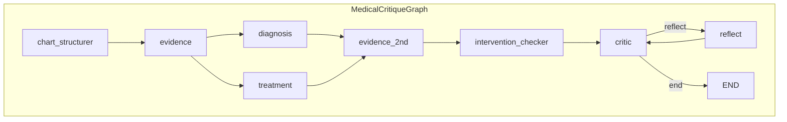

# LGBM-clean + Critic 통합 코드 분석

`MERGE_SUMMARY_CRITIC.md`를 기준으로 실제 코드를 따라가며 정리한 상세 분석입니다.

---

## 0. 프로젝트 내 에이전트 목록 및 역할

이 폴더(`src/agents` 및 `src/agents/nodes`)에 존재하는 에이전트와, 각각의 역할을 정리합니다.

### 0.1 그래프에서 실제로 사용 중인 에이전트 (노드 ↔ 구현)

| 노드 이름 | 구현 위치 | 역할 (한 줄) |
|-----------|-----------|----------------|
| **chart_structurer** | `nodes/chart_structurer.py` → `run_chart_structurer` | **차트 구조화(IE)** — 의료 차트 텍스트에서 demographics, vitals, symptoms, red_flags, interventions_given 등을 JSON으로 추출. |
| **evidence** | `nodes/evidence_agent.py` → `run_evidence_agent` | **1차 Evidence (CRAG)** — PubMed·내부 RAG 검색, LLM 쿼리 생성·품질 평가. 유사케이스 + 일반 검색으로 근거 수집. |
| **diagnosis** | `nodes/diagnosis_agent.py` → `run_diagnosis_agent` | **진단 적절성 분석** — 구조화 차트·근거 기반으로 진단 평가, missed diagnosis·타이밍·실제 경과 분석. (GPT-4o, `agents/llm`) |
| **treatment** | `nodes/treatment_agent.py` → `run_treatment_agent` | **치료 적절성 분석** — 시행된 치료 확인 후 선택·용량·타이밍·가이드라인·disposition 평가. (GPT-4o, `agents/llm`) |
| **evidence_2nd** | `nodes/evidence_agent.py` → `run_evidence_agent_2nd_pass` | **2차 Evidence** — 1차 비판(diagnosis/treatment 이슈)을 반영한 **비판 기반 타겟 검색**으로 추가 근거 수집. |
| **intervention_checker** | `nodes/intervention_checker.py` → `check_intervention_coverage` | **이미 시행된 치료 확인** — 구조화 차트에서 interventions_given 추출 후, Diagnosis/Treatment 비판 중 “치료 부재”류를 걸러 내고 적절성 평가로 정리. (에이전트라기보다 규칙 기반 검사기) |
| **critic** | `graph.py` → `_critic_node` (내부: `critic_agent.runner.run_agent`) | **LGBM-style Critic** — 전처리(timeline, evidence, record_gaps) → Router → 도구 실행 → CritiqueBuilder → Feedback 루프. 선택적으로 Verifier로 solutions 보강 후, critique/solutions 정규화·confidence/iteration 설정해 state 반영. |
| **reflect** | `graph.py` → `_reflect_node` | **Reflexion 메모리** — critique 중 severity가 `critical`인 이슈만 모아 `memory`에 문자열로 추가. (에이전트라기보다 state 갱신 노드) |

### 0.2 nodes 폴더에 정의된 함수·역할 (파일 기준)

| 파일 | 진입 함수 | 역할 |
|------|-----------|------|
| `chart_structurer.py` | `run_chart_structurer(state)` | 의료 차트 → 구조화 JSON (demographics, vitals, symptoms, interventions_given 등). |
| `evidence_agent.py` | `run_evidence_agent(state, rag_retriever)` | 1차 CRAG: PubMed + RAG + LLM 분석·검증. |
| `evidence_agent.py` | `run_evidence_agent_2nd_pass(state)` | 비판 기반 2차 검색. |
| `diagnosis_agent.py` | `run_diagnosis_agent(state)` | 진단 평가, 이슈·missed diagnosis·타이밍·실제 경과 분석. |
| `treatment_agent.py` | `run_treatment_agent(state)` | 치료·disposition 적절성 평가. |
| `intervention_checker.py` | `check_intervention_coverage(state)` | 시행된 치료 기준으로 비판 필터링·coverage 정리. |
| `critic_agent.py` | `run_critic_agent(state)` | **GPT-4o 단일 호출**로 진단/치료/근거를 종합해 critique_points·solutions 생성. **현재 그래프에서는 미사용** — critic 노드는 `src/critic_agent/runner.run_agent`(LGBM 파이프라인)을 사용함. |

### 0.3 Critic 두 종류 정리

- **현재 그래프에서 쓰는 Critic**  
  - `graph._critic_node` → `clean_state_to_agent_state` → `run_agent`(`src/critic_agent/runner`) → 전처리·Router·도구·CritiqueBuilder·Feedback → adapter → Verifier(선택)·정규화·confidence/iteration.  
  - 즉 **LGBM-style** (도구 + 피드백 루프).

- **nodes에만 있는 Critic**  
  - `nodes/critic_agent.run_critic_agent`: 진입·진단·치료·근거·memory를 한 번에 넘기고 **GPT-4o 한 번 호출**로 critique_points·solutions 생성.  
  - 그래프에는 연결되어 있지 않음 (레거시/대안용으로 남아 있음).

---

## 1. State 이원화와 Adapter

### 1.1 그래프 State (`src/agents/state.py`)

- **타입**: `AgentState` (TypedDict)
- **역할**: LangGraph 전체 파이프라인의 단일 상태.
- **필드 구성**:
  - **업스트림**: `patient_case`, `similar_cases`, `structured_chart`, `diagnosis_analysis`, `treatment_analysis`, `evidence`, `intervention_coverage`
  - **Critic 전용** (run_agent가 채움): `preprocessing`, `lens_results`, `behavior_results`, `router`, `trace`, `similar_case_patterns`
  - **Critic 출력/제어**: `critique`, `solutions`, `iteration`, `confidence`, `memory` (Annotated[List[str], add]로 누적)

### 1.2 Critic 내부 State (`src/agents/critic_adapter.py` + `src/critic_agent/types.py`)

- **CriticAgentState** (critic_adapter): `run_agent()`에 넘길 때 사용하는 dataclass.
- **AgentState** (types.py): Critic 패키지 내부에서 사용하는 dataclass. 필드 구성이 동일 (patient, cohort_data, similar_case_patterns, preprocessing, lens_results, behavior_results, router, trace, `add_trace` 메서드).
- **관계**: `clean_state_to_agent_state()`가 그래프 state → `CriticAgentState`로 변환하고, `run_agent()`는 이 객체를 그대로 `AgentState`처럼 사용(덕 타이핑).

### 1.3 Adapter 함수

| 함수 | 위치 | 역할 |
|------|------|------|
| `clean_state_to_agent_state(clean_state)` | critic_adapter | 그래프 state → Critic state. `patient_case`→`patient`(id, text, age, sex, status 등), `similar_cases`→`cohort_data["similar_cases"]`, Critic용 필드는 기존 값 유지 또는 빈 dict/list. |
| `agent_state_to_clean_updates(critic_state, critique_result)` | critic_adapter | Critic 결과 → 그래프에 merge할 dict. `critique`(critique_points/critique), `solutions`(normalize_solutions 적용), `preprocessing`, `lens_results`, `behavior_results`, `router`, `trace` 반환. |
| `normalize_solutions(solutions)` | critic_adapter | 문자열 리스트 또는 Verifier 형식(issue, solution, evidence, priority) → `{ action, citation, priority }` 리스트로 통일. |

---

## 2. 그래프와 Critic 노드 (`src/agents/graph.py`)

### 2.0 LangGraph 노드 그래프 (노드·엣지 형식)

**노드 목록** (StateGraph에 등록된 8개):

| 노드 이름 | 설명 |
|-----------|------|
| `chart_structurer` | 진입점. 차트 구조화(IE). |
| `evidence` | 1차 Evidence (CRAG: 유사케이스 + 일반검색). |
| `diagnosis` | 진단 분석 (GPT-4o). |
| `treatment` | 치료 분석 (GPT-4o). |
| `evidence_2nd` | 2차 Evidence (비판 기반 타겟 검색). |
| `intervention_checker` | 이미 시행된 치료 확인. |
| `critic` | LGBM-style Critic (adapter → run_agent → Verifier·정규화 → state 반영). |
| `reflect` | critical 이슈만 memory에 저장. |

**엣지 정의**:

```
[ENTRY]
   │
   ▼
chart_structurer ──► evidence ──┬──► diagnosis  ──┐
                                │                  │
                                └──► treatment ────┼──► evidence_2nd ──► intervention_checker ──► critic
                                                                                    │
                                                                                    │ set_conditional_edges("critic", _should_continue, ...)
                                                                                    ▼
                                                                            ┌───────┴───────┐
                                                                            │               │
                                                                            ▼               ▼
                                                                        "reflect"        "end"
                                                                            │               │
                                                                            ▼               ▼
                                                                        reflect          [END]
                                                                            │
                                                                            └──────────────► critic  (재진입)
```

**조건부 분기 (`_should_continue`)**:
- `iteration >= max_iterations` 또는 `confidence > 0.8` → **"end"** → END
- 그 외 → **"reflect"** → `reflect` 노드 → (엣지) → **critic** (Critic만 재실행)

**Mermaid 형식** (다이어그램 렌더링용):



### 2.1 파이프라인 순서 (요약)

```
chart_structurer → evidence → diagnosis / treatment(병렬) → evidence_2nd → intervention_checker → critic
                                                                                    ↓
                                                                        _should_continue
                                                                           ↓     ↓
                                                                        reflect  end
                                                                           ↓
                                                                        critic (재실행)
```

- **reflect**: 풀 리셋이 아니라 **critic만 재실행**. `reflect` 노드는 `memory`에 critical 이슈만 추가.

### 2.2 `_critic_node` 동작 (단계별)

1. **진입 변환**: `critic_state = clean_state_to_agent_state(state)`
2. **Critic 실행**: `run_agent(state=critic_state, registry, preprocessing_tools=["timeline","evidence","record_gaps"], config=AgentConfig())` → `(critic_state, critique_result)`
3. **그래프용 업데이트**: `updates = agent_state_to_clean_updates(critic_state, critique_result)`
4. **Verifier (선택)**: `similar_cases`가 있고 `OPENAI_API_KEY`가 있으면 Verifier 호출 후, 반환된 solutions로 `updates["solutions"]` 교체. 실패 시 기존 recommendations 기반 solutions 유지.
5. **Phase 6 정규화**:  
   - critique 각 항목: `point` → `issue`, `severity == "high"` → `"critical"`, `category` 없으면 `"process"`.  
   - `updates["critique"]` = 정규화된 리스트.
6. **confidence / iteration**:  
   - `critic_state.trace`에서 마지막 `tool=="feedback"` 항목의 `detail.ok`로 confidence: True면 0.8, 아니면 0.5.  
   - `iteration` = 기존 iteration + 1.  
   - `updates["iteration"]`, `updates["confidence"]` 설정 후 반환.

### 2.3 `_reflect_node`

- `critique` 중 `severity == "critical"`인 항목의 `issue`만 모아서  
  `reflection = "Iteration {n}: Critical issues: {issues}"`  
  형태로 `memory`에 하나의 문자열로 append.

### 2.4 `_should_continue`

- `iteration >= max_iterations` 또는 `confidence > 0.8` → `"end"`
- 그 외 → `"reflect"` (critic만 다시 실행).

### 2.5 initial_state

- `confidence: None` 포함. 반복/종료 판단 시 `state.get("confidence", 0.5)`로 사용하므로 첫 critic 전에는 0.5로 취급됨.

---

## 3. Critic Agent 내부 (`src/critic_agent/`)

### 3.1 Runner (`runner.py`)

- **진입**: 전처리 도구 3개(timeline, evidence, record_gaps) **항상** 실행 → `state.preprocessing` 채움.
- **behavior_topk_direct_compare**: `cohort_data.similar_cases`가 있고 예산 남으면 **선실행** → `state.behavior_results["behavior_topk_direct_compare"]`.
- **라우팅**: 매 feedback 라운드마다 `LLMRouter(...).select(...)` 호출.  
  - `router.py`의 `LLMRouter._enabled()`: `CARE_CRITIC_ROUTER_LLM == "1"`일 때만 LLM 라우터, 아니면 내부에서 `HeuristicRouter().select(...)`로 fallback.
- **도구 실행**: 선택된 도구만 예산(`max_tools`) 내에서 실행. lens_* → `lens_results`, behavior_* → `behavior_results`.
- **CritiqueBuilder**: 현재 state + (이전 critique, patch_instructions)로 비판 생성/수정.
- **Feedback**: `CritiqueFeedback.decide(...)` → ok면 루프 종료, 아니면 `requested_tools` 실행 후 다음 라운드에서 CritiqueBuilder 재호출.  
  - `feedback_rounds`만큼 라운드 제한.
- **반환**: `(state, critique)` (critique는 dict: critique_points, risk_factors, recommendations 등).

### 3.2 Router (`router.py`)

- **HeuristicRouter**: 텍스트 길이 버킷, severe 키워드, dx 키워드로 lens/behavior 도구 선택. LLM 없음.
- **LLMRouter**: `CARE_CRITIC_ROUTER_LLM=1`일 때만 활성. ToolRAG로 카드 검색 후 LLM이 도구 목록 선택. 그 외에는 HeuristicRouter로 위임.

### 3.3 CritiqueBuilder (`critique_builder.py`)

- **OPENAI_API_KEY** 있음: `_build_with_llm` — preprocessing, lens_results, behavior_results, previous_critique, patch_instructions를 넣고 구조화된 critique(analysis, critique_points, risk_factors, recommendations) 생성.  
  - critique_points 항목: `point`, `span_id`, `severity`(high/medium/low), `cohort_comparison`.
- **키 없음**: `_build_heuristic` — lens/behavior 요약만으로 소수의 휴리스틱 critique_points 생성 (severity "high" 사용).

### 3.4 Feedback (`feedback.py`)

- **OPENAI_API_KEY** 있음: LLM으로 충분성 판단 + `requested_tools`, `patch_instructions` 생성.
- **키 없음**: 휴리스틱 — critique_points 개수, span_id 누락 개수로 판단. 부족하면 behavior_topk_direct_compare, lens_diagnostic_consistency 요청.

### 3.5 Verifier (`verifier.py`)

- **입력**: critique(critique_points, risk_factors, recommendations), similar_cases_topk.
- **출력**: `{ "patient_id", "solutions": [ { "issue", "solution", "evidence", "priority" } ], "raw" }`.  
  그래프 쪽에서 `normalize_solutions(verifier_result["solutions"])`로 `action`/`citation`/`priority` 형식으로 변환해 사용.

### 3.6 Registry (`registry.py`)

- 전처리: PreprocessTimelineTool, PreprocessEvidenceTool, PreprocessRecordGapTool.
- Lens: LensSeverityRisk, LensDiagnosticConsistency, LensMonitoringResponse.
- Behavior: BehaviorTopKDirectCompareTool.

---

## 4. LLM 역할 분리

| 용도 | 모듈 | 비고 |
|------|------|------|
| 그래프 노드 (Chart Structurer, Diagnosis, Treatment, Evidence 등) | `src/agents/llm.py` | `get_llm()` → `LLMWrapper`, OpenAI client 직접 사용. |
| Critic/Verifier/도구 (Router, CritiqueBuilder, Feedback, Verifier) | `src/llm/openai_chat.py` | `OpenAIChatConfig`, `call_openai_chat_completions`, `safe_json_loads`. |

`src/llm/__init__.py` docstring에 위 역할 구분이 명시되어 있음.

---

## 5. PR 반영 사항과의 대응

- **iteration / confidence**: critic 노드에서 `updates["iteration"]`, `updates["confidence"]` 설정하고, `_should_continue`에서 `iteration >= max_iterations` 또는 `confidence > 0.8`이면 종료. 문서/요약과 일치.
- **reflection**: `_reflect_node`에서 **critical** 이슈만 수집해 `"Critical issues: {issues}"` 형태로 memory에 추가. (high → critical 정규화는 critic 노드에서 이미 수행된 뒤이므로 severity 기준이 맞음.)
- **critique 정규화**: `point`→`issue`, `high`→`critical`, `category` 기본값 `process` — graph.py의 _critic_node 5단계에서 처리.
- **initial_state**: `confidence: None` 포함 — graph.py `run()` 내 initial_state에 있음.

---

## 6. 데이터 흐름 요약

1. **입력**: `patient_case`, `similar_cases` → initial_state.
2. **그래프**: 각 노드가 state를 읽고, 반환 dict만 merge.
3. **critic 노드**:  
   graph state → adapter → Critic state → run_agent(전처리 → 라우터 → 도구 → CritiqueBuilder → Feedback 루프) → adapter → graph용 업데이트.  
   선택적으로 Verifier로 solutions 보강 후, critique 정규화 및 confidence/iteration 설정 → merge.
4. **반복**: reflect 시 critic만 재실행, memory에 critical 이슈 추가.
5. **출력**: `run()` 반환값의 `critique`, `solutions` 등이 run_agent_critique.py 및 리포트 형식(issue, severity, category, action/citation/priority)과 호환.

---

## 7. Evidence(근거 수집) vs Critic 자율 도구 — 역할 차이와 효율

**질문**: Evidence 노드에서 이미 근거를 수집하는데, Critic에서 또 자율 도구를 쓰면 비효율 아닌가?

### 7.1 역할이 다름 (수집 대상·형식·소비자)

| 구분 | Evidence Agent (1차·2차) | Critic 전처리·도구 |
|------|---------------------------|---------------------|
| **대상** | **외부 지식** — PubMed, 내부 RAG (문헌·가이드라인·유사 케이스 요약) | **해당 환자 차트 텍스트** — 같은 `patient.text`에서 구조 추출 |
| **산출물** | `evidence.internal` / `evidence.external` (검색 결과, 검증, clinical_analysis) | `preprocessing.timeline`, `preprocessing.evidence`(evidence_spans **E1, E2, …**), `preprocessing.record_gaps` + lens/behavior 결과 |
| **목적** | Diagnosis/Treatment Agent가 “무슨 근거로 비판할지” **내용**을 채우기 위함 | CritiqueBuilder가 **비판 문장에 span_id(E1, E2) 인용**·타임라인·감시 지연 등 **구조 기반 비판**을 만들기 위함 |
| **전달** | 그래프 state의 `evidence` → diagnosis/treatment 노드에서 사용 | Critic state 내부에서만 사용. **그래프의 `evidence`는 adapter를 통해 Critic에 넘기지 않음.** |

- Evidence Agent의 “근거” = **문헌/가이드라인/유사케이스 검색 결과** (외부 근거).
- Critic의 “evidence” 도구 = **차트 내 문장 단위 span + E1,E2,… ID 부여** (인용용 인덱스).  
→ **같은 말이 아님.** Evidence는 “외부 근거 수집”, Critic evidence 도구는 “차트 내 인용 가능한 구간 나누기”.

### 7.2 왜 겹쳐 보일 수 있나

- “근거 수집”을 **한 종류**로 보면, “Evidence에서 이미 했는데 Critic에서 또 하지 않나?”라고 느낄 수 있음.
- 실제로는 **Evidence = 외부 검색**, **Critic 전처리 = 같은 차트 텍스트 재가공**이라, **수집 대상과 출력 형식이 다름**.
- 다만 **같은 차트 텍스트**를 Chart Structurer(구조화)와 Critic(타임라인·evidence_spans·record_gaps)이 **각각 한 번씩** 읽는 부분은 있음.  
  → “차트 파싱” 관점에서는 이중 작업 가능성 있음.

### 7.3 정리 및 개선 여지

- **비효율이 큰가?**  
  - **외부 근거**: Evidence만 수집하고, Critic은 그 결과를 직접 쓰지 않음. Critic 도구는 PubMed/RAG를 다시 돌리지 않음.  
  - **차트 파싱**: Chart Structurer(IE)와 Critic 전처리(timeline, evidence_spans, record_gaps)가 **동일 차트 텍스트**를 서로 다른 형식으로 다시 읽음.  
  - 따라서 “Evidence에서 이미 수집한 걸 Critic이 또 수집한다”는 **외부 근거** 기준으로는 해당 없고, **차트 한 번 더 파싱** 쪽에만 중복 여지가 있음.
- **개선 아이디어**  
  - 그래프의 `structured_chart`(또는 이미 있는 구조)를 adapter로 Critic state에 넘기고, `run_agent` 진입 시 **이미 있으면 전처리 도구 일부 스킵**하도록 하면, 같은 차트를 두 번 파싱하는 비용은 줄일 수 있음.  
  - 대신 Critic이 “patient.text + cohort만으로 동작”하는 **독립 파이프라인** 설계와는 맞 trade-off임.

### 7.4 단일 근거 수집이면 여러 관점의 비판이 불가능하다

**핵심**: 비판은 **근거를 기준으로** 만들어진다. 근거를 **한 종류·한 번만** 모으면, 비판도 **한 관점**으로만 나온다.

- **Evidence 노드**: (외부) 문헌·가이드라인·유사케이스 요약을 **한 번** 모아서 Diagnosis/Treatment에 넘김.  
  → 그 결과만으로 “최종 비판”을 한 에이전트가 만들면, **그 근거에 묶인 한 가지 시각**만 나올 수 있음.
- **Critic의 여러 도구(관점)**:  
  - **lens_severity_risk** → 중증도/리스크 관점의 근거 (severity_flags 등)  
  - **lens_monitoring_response** → 악화 신호 대비 반응·지연 관점의 근거 (lags 등)  
  - **lens_diagnostic_consistency** → 진단 결론과 근거 정렬·갭 관점  
  - **behavior_topk_direct_compare** → 유사 케이스와의 차이 관점  
  각 도구가 **서로 다른 관점의 근거**를 만들고, CritiqueBuilder가 그걸 **합쳐서** 비판을 만든다.
- 따라서 **“근거 수집을 단일 agent로만 하면”** → 그 한 종류 근거에만 기대게 되고 → **여러 관점의 비판(중증도/모니터링/진단 일관성/코호트 비교 등)을 만들 수 없음**.  
  Critic에서 **여러 자율 도구를 쓰는 구조**가 있어야, **관점별 근거 → 관점별 비판**이 가능해진다.

---

## 8. 정리

- **한 개의 그래프 state**로 흐르고, Critic 구간만 **adapter로 LGBM 형 state로 바꿨다가 다시 그래프 형으로 되돌리는** 구조가 코드 전반에 일관되게 구현되어 있음.
- **Phase 1~6** 반영 사항(State 확장, adapter, run_agent 연결, Verifier·normalize_solutions, 정규화·confidence·iteration·reflect)이 `MERGE_SUMMARY_CRITIC.md`와 일치함.
- 라우터는 항상 `LLMRouter`를 호출하되, 환경변수로 휴리스틱/LLM 전환이 되고, Critic/그래프용 LLM 모듈이 분리되어 있음.
